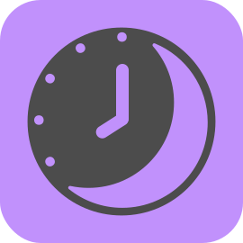
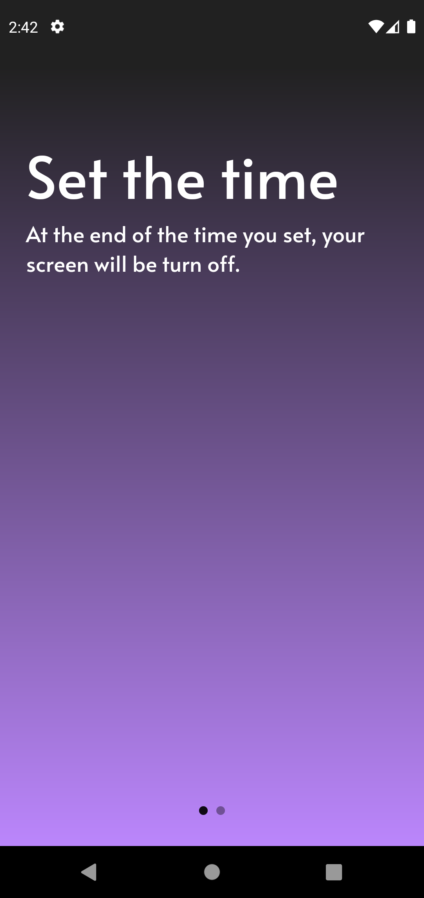
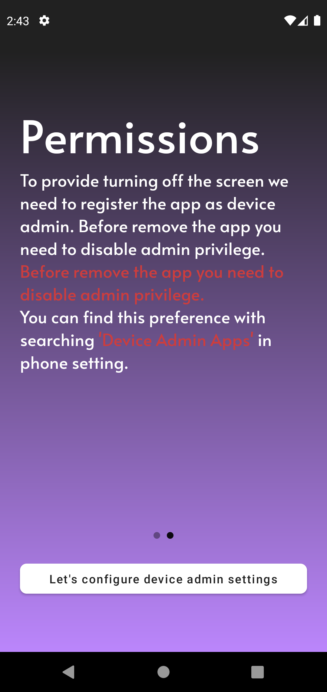
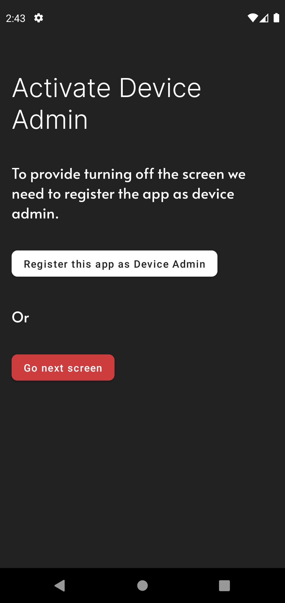
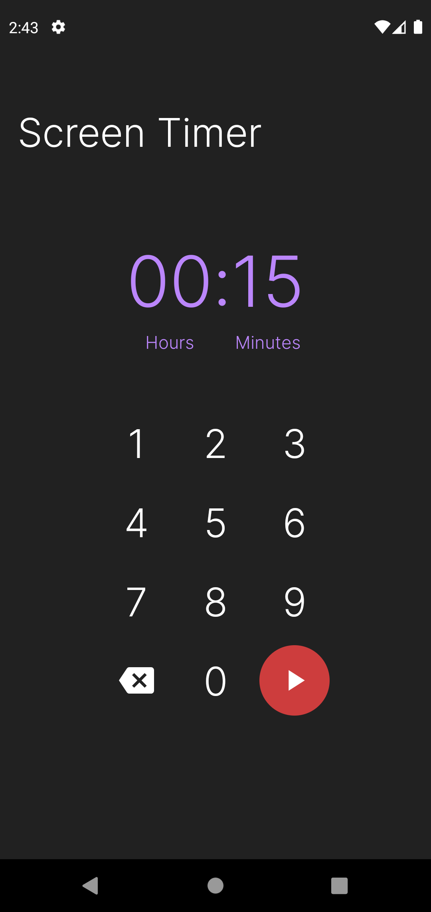
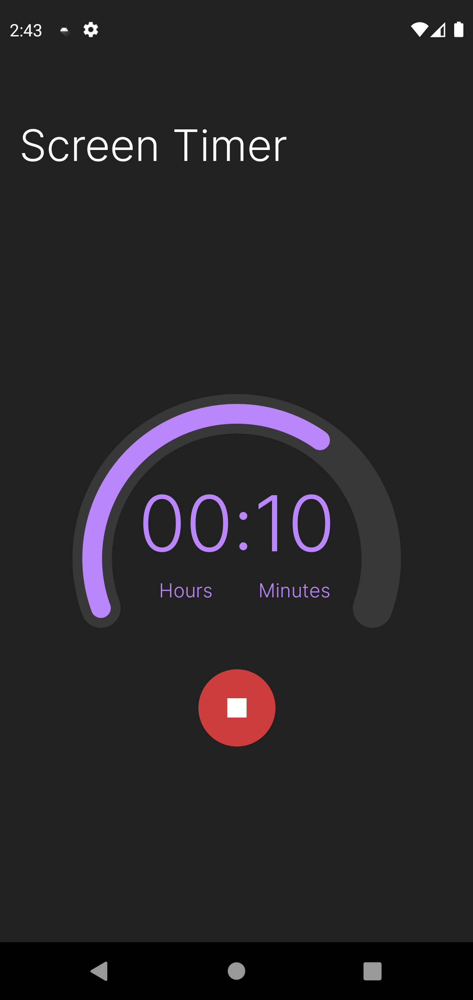

# Screen Timer

Screen Timer is an android applicaiton gives you to control when the screen will lock.
 

For example you are watching your favorite twitch streamer before falling into sleep and too lazy to close the app and lock the screen :). Screen Timer will do it for you.

[Get this app from Google Play Store](https://play.google.com/store/apps/details?id=com.ToolCompany.screentimer).

## Screenshots

## What did I use

* Jetpack Compose for UI
* Proto DataStore for data related with app
* Kotlin Coroutines for reading and writing the data
* Accompanist Pager and Indicators for on boarding screen
* Hilt for dependency injection
* Compose Navigation for navigating
* Lock screen functionality provided with device admin privilege so there are simple logic to how to gets this privilege
* Android Foreground Services for counting down and locking the screen while app killed or in background.
* Kotlin extension used for repetitive context related functionalty

